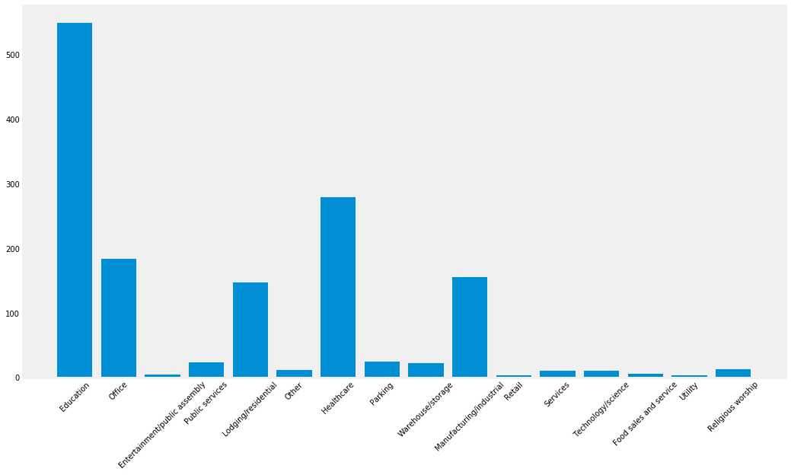
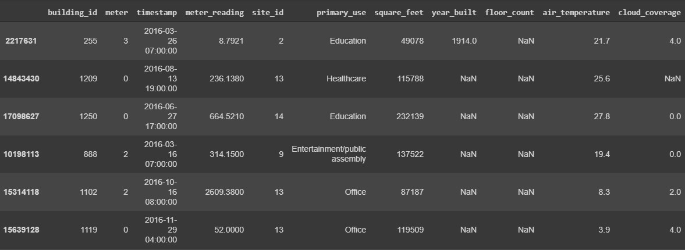

# ASHRAE---Great-Energy-Predictor-III
How much energy will a building consume?
Energy prediction system based on Deep Learning :

Key words : Deep Learning, Word Embedding, LSTM.

# Software environment

1- The interpreted programming language: Python.

2- The free cloud service offered by Google: Google Colab

3- The Python libraries:

   Keras with backend TensorFlow.

   Matplotlib: to plot and visualize data in the form of graphs.
                       
   Seaborn: for data visualization based on matplotlib.
                       
   Pandas: for data manipulation and analysis.
                       
   Numpy: to manipulate multidimensional matrices and mathematical functions.
   
# Plan

1-	Project Overview

2-	Data Understanding

3-	Data Preparation

4-	Data Modeling

5- Results Analysis

## Project Overview

### Overview

It costs a lot to cool a skyscraper in the summer and not just in dollars, but in environmental impact. Thankfully, significant investments are being made to improve building efficiencies to reduce costs and emissions.
==> Develop accurate predictions of metered building energy usage in the following areas: chilled water, electric, natural gas, hot water, and steam meters. The data comes from over 1,000 buildings over a three-year timeframe.

### Introduction

As the impact of climate change is being felt more increasingly, organizations are looking for ways to lower their energy footprint. Highest energy users are defined as those with the highest energy consumption as determined by their energy meter readings.
==> Prioritize resources to provide the greatest impact, ultimately resulting in reduced energy consumption and a more environmentally friendly solution.

### Objective

Provide a reliable and feasible Deep Neural Network algorithm to predict: How much energy will a building consume?

## Data Understanding

### Datasets Reading

Files:

1- train.csv:

building_id - Foreign key for the building metadata.

meter - The meter id code. Read as {0: electricity, 1: chilledwater, 2: steam, hotwater: 3}. Not every building has all meter types.

timestamp - When the measurement was taken

meter_reading - The target variable. Energy consumption in kWh (or equivalent). Note that this is real data with measurement error, which we expect will impose a baseline level of modeling error.

2- building_meta.csv

site_id - Foreign key for the weather files.

building_id - Foreign key for training.csv

primary_use - Indicator of the primary category of activities for the building based on EnergyStar property type definitions

square_feet - Gross floor area of the building

year_built - Year building was opened

floor_count - Number of floors of the building

3- weather_[train/test].csv: Weather data from a meteorological station as close as possible to the site.

site_id

air_temperature - Degrees Celsius

cloud_coverage - Portion of the sky covered in clouds, in oktas

dew_temperature - Degrees Celsius

precip_depth_1_hr - Millimeters

sea_level_pressure - Millibar/hectopascals

wind_direction - Compass direction (0-360)

wind_speed - Meters per second

4- test.csv

### Data Visualisation

1- building_meta_df['primary_use‘]

2- train_df[‘site_id']

3- train_df['meter_reading']

4- Correlation between train_df['meter_reading'] and other variables

## Data Preparation

### Data Merging

Sample rows from combined dataframe

### Data Preprocessing

1- Change the 'primary_use' column to categorical

2- Check how many 'NaN' values has each column

A lot of NaN's in some of columns ==> Change them into numerical values or drop them (‘floor_count’ and ‘year_built’) in order to use this data in neural network

3- Check the description of train_df before Data Modeling

## Data Modeling

### Data Shaping

1- In order to run LSTM neural network data has to be in three dimentional shape where axis corresponds to following data:

x-axis time steps

y-axis data examples

z-axis features for single point in time

2- Take data for first 10 building_id's and preprocess them for LSTM neural network

Dictionary 'extracted_df' contains data for buildings_ids in range (0, 10)

==> Have to be reshaped in order to feed them 	into LSTM neural network

### Bulding Simple LSTM Network

In order to create our LSTM model with tensorflow keras, we need to do these steps:

1- Splitting data according to provided parameters

2- Preparing data for three sets of data (train, dev, val) for every 'building_id'

3- Standardizing features by removing mean and scaling according to variances

4- Fitting to every data set with given 'building_id'

### Model Summary

3 LSTM layers

2 Dropout layers ==> Prevent the model overfitting

Necessity of a Dense layer in the end

## Results Analysis

### Hyperparameters Choice

### Final Results
